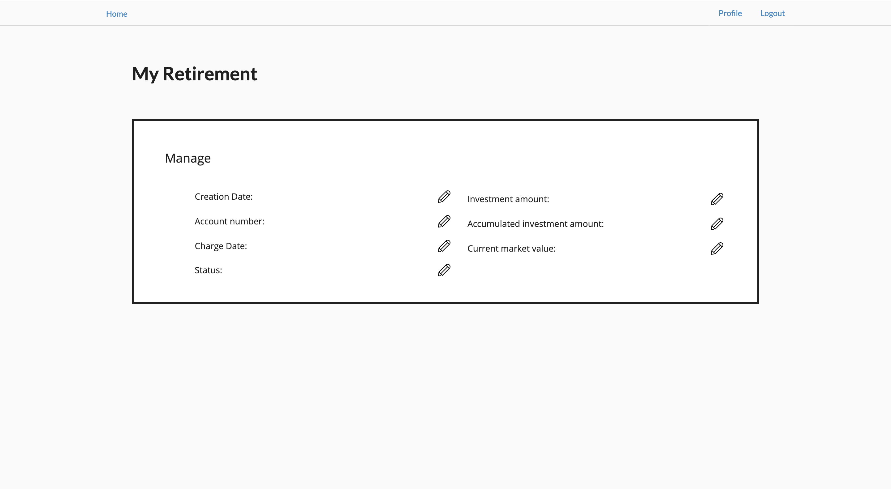
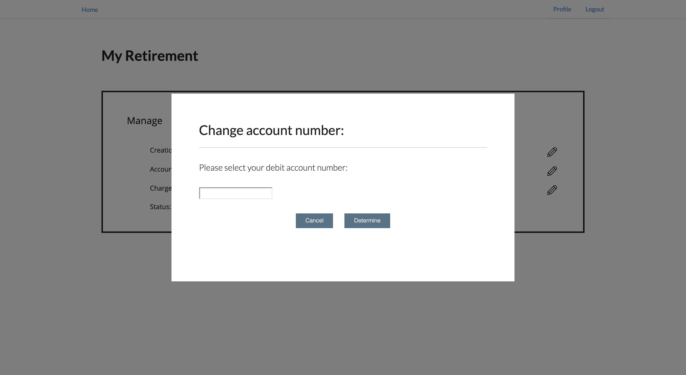

# My Retirement Tech Test

## Included

* Redux
* Sagas
* Reselect
* React router
* Jest and Enzyme
* Cypress support
* Scss
* Js lint and es6 lint
* i18n (internationalisation) support
* Precommit hooks
* React docgen and React styleguidist

## Setup

### Installation

* Install with yarn (not npm). Npm will break the documentation plugin and styleguide when it sets up react-docgen

```
yarn install
yarn start
```
Access on http://localhost:3000

### Doc and styleguide

```
npm run styleguide
```

Access on http://localhost:6060

This webpage is hosted on https://sleepy-eyrie-15686.herokuapp.com/

## Final thoughts

I thought it best to focus on the overall look and feel of the app however, if I had more time I would have used redux to display the data.  I also wanted to focus on making sure the app was made up of reusable components from the beginning so used my time to do that, focusing on practices such as SRP.

If I had more time I would work on refactoring the code and feeding the mock data through with Redux on the branch called `implementing-redux`.

## Example

### Homepage



### Popup


